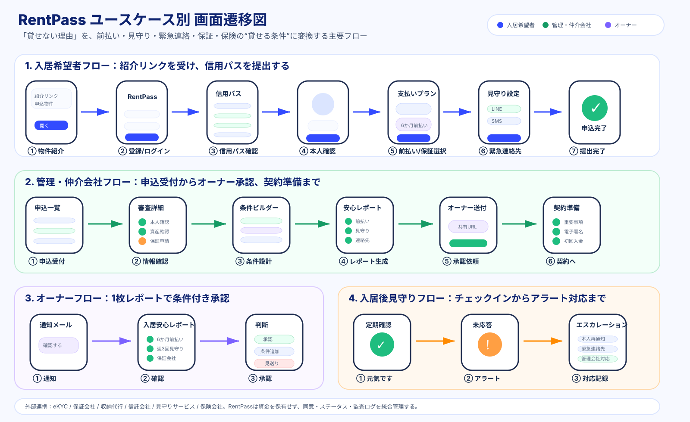

# 🛡️ RentPass（レントパス）

> **「貸せない理由」を、「貸せる条件」に変換する。**  
> 従来の入居審査では通りにくかった人に対し、支払い担保（外部信託・収納連携）・見守り安否確認・残置物合意・代替与信をパッケージ化し、貸主・管理会社が安心して貸せる条件を設計・管理する賃貸リスクマネジメントSaaS。

[](https://nextjs.org/)
[](https://www.typescriptlang.org/)
[](https://supabase.com/)
[](LICENSE)

---

## 📖 プロダクト概要

RentPassは、**「審査で落とす」のではなく「貸主が懸念するリスクを対策済み条件に変換して貸す」** アプローチのSaaSです。

日本国内では、単身高齢者、保証人を用意しづらい人、フリーランス、個人事業主、ナイトワーク従事者、外国人など、預貯金や支払い能力はあるのに画一的な会社員向け審査基準で説明しづらい入居希望者がいます。一方で貸主側も、孤独死、家賃滞納、残置物、緊急連絡不能への不安から、空室でも受け入れを躊躇します。

RentPassはこのギャップを、信用スコアではなく、**入居安心レポート** と **受け入れ条件ビルダー** で解決します。

```text
入居希望者
  ↓ 信用パス提出
管理会社・仲介会社
  ↓ 受け入れ条件設計
オーナー
  ↓ 条件付き承認
契約・入居後見守り
```

---

## 🌟 4つの安心の柱

1. **🧓 見守り・安否確認**
   - LINE / SMS / Web によるワンタップ定期安否確認。
   - 未応答時の段階的エスカレーション。
   - 管理会社向けの対応ログとアラート管理。

2. **🏦 前払い・保証・信託リザーブ**
   - RentPass自身は資金を預からない自社非預託アーキテクチャ。
   - 保証会社、収納代行、信託会社のステータスを統合管理。
   - 3〜12か月分の家賃リザーブ構想に対応。

3. **📄 代替信用証明**
   - 本人確認、収入・資産確認、前払い可能月数、緊急連絡体制、見守り設定を統合。
   - 職業名や年齢だけでなく、貸主が判断しやすい対策済み項目として提示。

4. **🤝 残置物・緊急対応ガバナンス**
   - 残置物処理、保険、支援者連携、緊急連絡先確認を一体で管理。
   - オーナーには詳細個人情報ではなく、必要な対策状況だけを開示。

---

## 🧭 画面遷移イメージ

主要ユースケースの画面遷移をSVGで管理しています。GitHub上でそのままプレビューできます。



---

## 📂 リポジトリ構成

```text
rentpass/
├── .github/                           # CI/CD & GitHub テンプレート
│   ├── workflows/ci.yml               # GitHub Actions
│   ├── ISSUE_TEMPLATE/                # バグ報告・機能提案テンプレート
│   └── pull_request_template.md
├── docs/                              # 仕様・事業戦略ドキュメント
│   ├── 00_PRFAQ.md                    # PRFAQ
│   ├── 01_LEAN_CANVAS.md              # リーンキャンバス
│   ├── 02_VALUE_PROPOSITION.md        # バリュープロポジション
│   ├── 03_REQUIREMENTS.md             # 要件定義
│   ├── 04_SCREEN_DESIGN.md            # 画面設計
│   ├── 05_GTM.md                      # GTM戦略
│   ├── 06_DATA_MODEL.md               # データモデル/RLS
│   ├── 07_COMPLIANCE_AND_RISK.md      # 法務・リスク論点
│   ├── 08_USE_CASE_TRANSITIONS.md     # ユースケース別画面遷移
│   ├── 09_PAYMENT_TRUST.md            # 前払家賃保全信託/エスクロー
│   ├── 10_ROADMAP.md                  # 開発・事業ロードマップ
│   ├── 11_MVP_IMPLEMENTATION_BACKLOG.md # MVP実装バックログ
│   └── assets/use-case-transitions.svg  # 画面遷移図
├── supabase/                          # DB定義 & シード
├── src/                               # Next.js / TypeScript アプリ
│   ├── app/page.tsx                   # トップ
│   ├── app/tenant/page.tsx            # 入居者ポータル
│   ├── app/management/page.tsx        # 管理・仲介ダッシュボード
│   └── app/owner/page.tsx             # オーナーポータル
├── package.json
├── tsconfig.json
├── next.config.mjs
└── README.md
```

---

## 🚀 クイックスタート

```bash
npm install
npm run dev
```

ブラウザで [http://localhost:3000](http://localhost:3000) を開きます。

型検査とビルド確認:

```bash
npm run typecheck
npm run build
```

---

## 🧩 MVP実装方針

MVPでは本格的な物件検索ポータルは作らず、**紹介された物件に対して信用パスを提出し、管理会社が受け入れ条件を設計し、オーナーが入居安心レポートで判断する** ところに集中します。

実装順序:

1. 型とモックデータを固める
2. 入居希望者信用パスを実装する
3. 管理会社申込レビューを実装する
4. 受け入れ条件ビルダーを実装する
5. オーナー向けレポートを実装する
6. 入居後見守りを実装する
7. Supabase連携を本実装へ移す
8. 外部サービス連携をスタブから実APIへ差し替える

詳細は [`docs/11_MVP_IMPLEMENTATION_BACKLOG.md`](docs/11_MVP_IMPLEMENTATION_BACKLOG.md) を参照してください。

---

## ⚠️ 設計上の重要原則

- RentPassは信用スコアで人を選別しない。
- 「信用が低い人」ではなく「従来審査では信用を証明しにくい人」と扱う。
- RentPass自身は前払い家賃を預からない。
- オーナーには詳細な健康情報、通帳画像、センシティブな事情を出しすぎない。
- 管理会社・オーナー・入居希望者の権限を分離し、重要操作を監査ログに残す。

---

## 📜 ライセンス

MIT License
