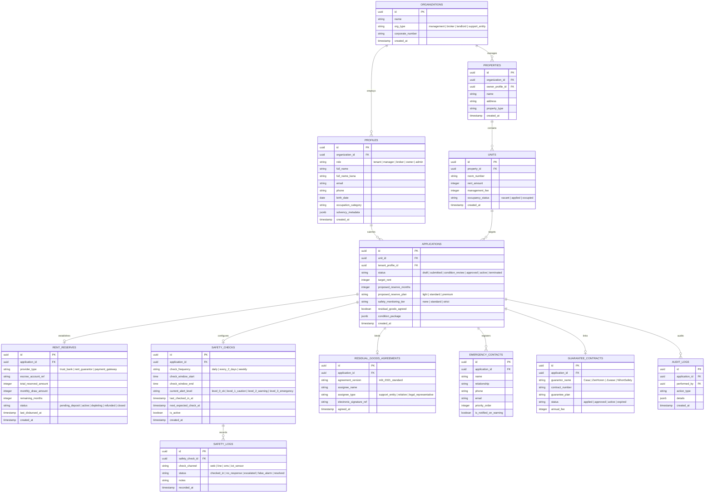

# RentPass: データモデル & データベース設計 (Data Model)

本ドキュメントでは、RentPassのエンティティ関係（ER）、テーブル定義、およびSupabase / PostgreSQLにおけるデータモデルを定義します。

---

## 1. エンティティ関連図 (Mermaid ERD)

---

## 2. セキュリティ & RLS (Row Level Security) 原則

1. **テナント分離**:
   入居者本人は自身のプロフィール、申請、安否ログ、リザーブ残高のみ閲覧・操作可能。
2. **管理会社スコープ**:
   自組織（Organization）が管理する物件・ユニット・申請・安否アラートのすべてを操作可能。
3. **オーナー権限**:
   自身が所有する物件に紐づくリザーブ保全状況および稼働状況を読み取り可能。
4. **個人情報保護**:
   機密情報（身分証、生年月日、口座番号）は暗号化フィールドに格納し、監査ログでアクセス履歴を追跡。
