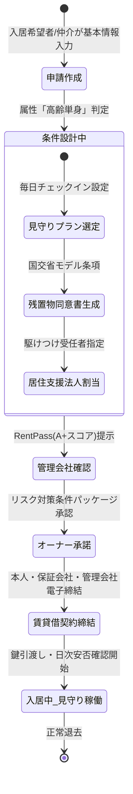
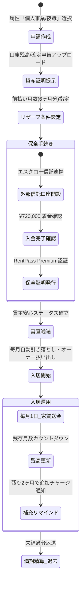
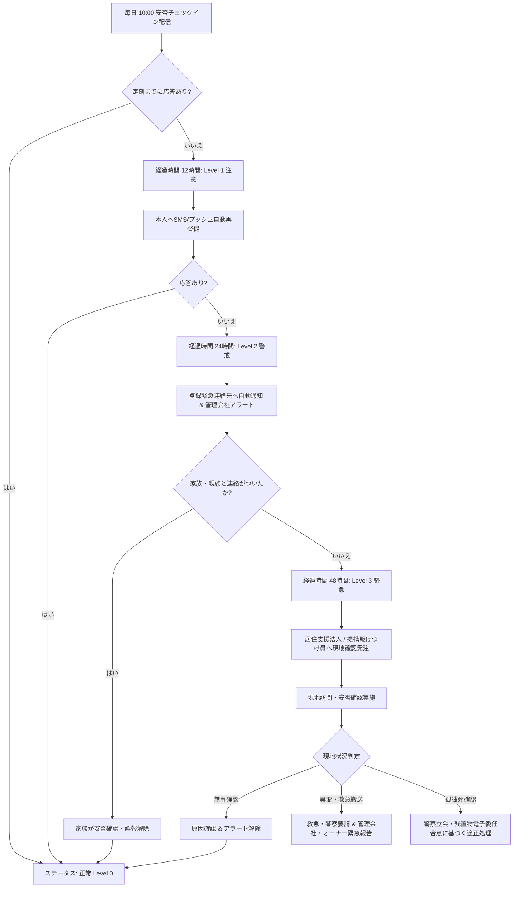

# RentPass: ユースケース別ライフサイクル状態遷移図 (Use Case Transitions)

本ドキュメントでは、RentPassの主要3ユースケース（単身高齢者、フリーランス/ナイトワーク、安否アラート発生時）における完全な状態遷移フローを定義します。

---

## ユースケース 1: 単身高齢者の見守り付き入居フロー (Senior Tenant Flow)

---

## ユースケース 2: フリーランス・夜職の前払いリザーブ信託フロー (Nightlife / Freelancer Reserve Flow)

---

## ユースケース 3: 安否未応答時の段階的エスカレーションフロー (Safety Alert Escalation Flow)

