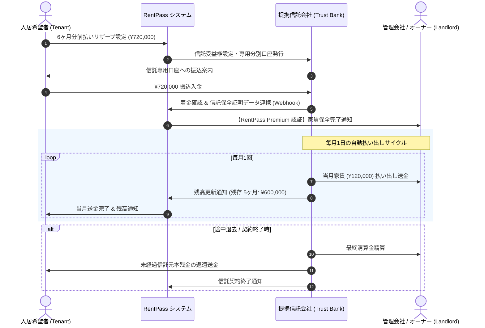

# RentPass: 前払い家賃保全信託 & 決済アーキテクチャ (Payment & Trust)

本ドキュメントでは、RentPassにおける家賃前払い・リザーブ保全（Payment Trust / Escrow）の法務設計、資金フロー、および外部連携アーキテクチャを定義します。

---

## 1. 資金保全における基本原則: 「自社非預託」

RentPassが最も警戒すべきは、**出資法・資金決済法違反（無認可での預り金・資金移動業違反）**です。
そのため、以下の原則を厳守します。

> **RentPassは入居者からの資金を自社名義の口座で1円も保管・預託しない。**  
> 資金の分別管理・保管・送金はすべて**信託銀行・信託会社**または**家賃保証会社＋収納代行業者**に委ね、RentPassはその「保全状態」「残高」「払い出し予定」を可視化・管理するSaaSに徹する。

---

## 2. 3段階の支払い担保プラン比較

```
┌─────────────────┐       ┌─────────────────┐       ┌─────────────────┐
│   Light プラン   │       │ Standard プラン │       │  Premium プラン  │
│  (簡易前払い証明) │       │ (保証会社+収納) │       │ (エスクロー信託) │
├─────────────────┤       ├─────────────────┤       ├─────────────────┤
│・前払い意思の提示 │       │・保証会社通常加入 │       │・信託口座へ一括預託│
│・直接貸主へ前払い │       │・収納代行口座振替 │       │・未経過分を完全保全│
│・システム保全なし │       │・滞納時代位弁済   │       │・毎月自動払い出し  │
└─────────────────┘       └─────────────────┘       └─────────────────┘
```

| プラン | 対象ペルソナ | 仕組み | 法的リスク |
| :--- | :--- | :--- | :--- |
| **Light (簡易)** | 預貯金はあるが保証会社審査で枠を増やしたい人 | 入居者がオーナー/管理会社口座へ直接前払い。RentPassは合意書面を記録。 | ゼロ（システム内資金移動なし） |
| **Standard (標準)** | 一般的なフリーランス・個人事業主 | 提携保証会社（Casa/全保連等）と収納代行（GMO-PG/SMBC-GP）を組み合わせ、月次引き落とし。 | ゼロ（認可収納代行会社が処理） |
| **Premium (信託保全)** | ナイトワーク・高額家賃希望者・外国人富裕層 | 提携信託会社（りそな信託・三菱UFJ信託等の前払家賃保全信託）に6〜12ヶ月分を信託預託。 | ゼロ（信託法に基づく倒産隔離・分別管理） |

---

## 3. 信託保全スキーム (Premium Plan) の資金フロー図



---

## 4. 信託会社との連携メリット

1. **倒産隔離**:
   万一、管理会社やRentPass運営元が破綻した場合でも、信託法により入居者の預託金は保全され、オーナーまたは入居者へ確実に返還されます。
2. **オーナーの安心感**:
   信託銀行発行の保全証明書が提示されるため、夜職やフリーランスであっても大半のオーナーが無条件で承認に転じます。
3. **収益モデル**:
   信託組成手数料および月次管理手数料の一部を、信託会社とのレベニューシェアとして受領します。
