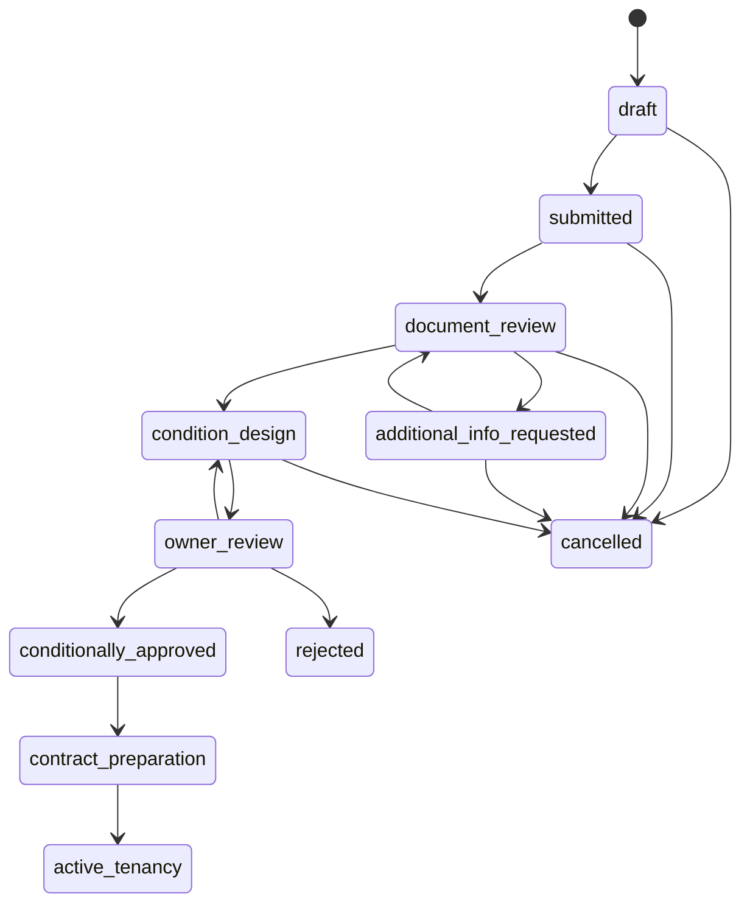
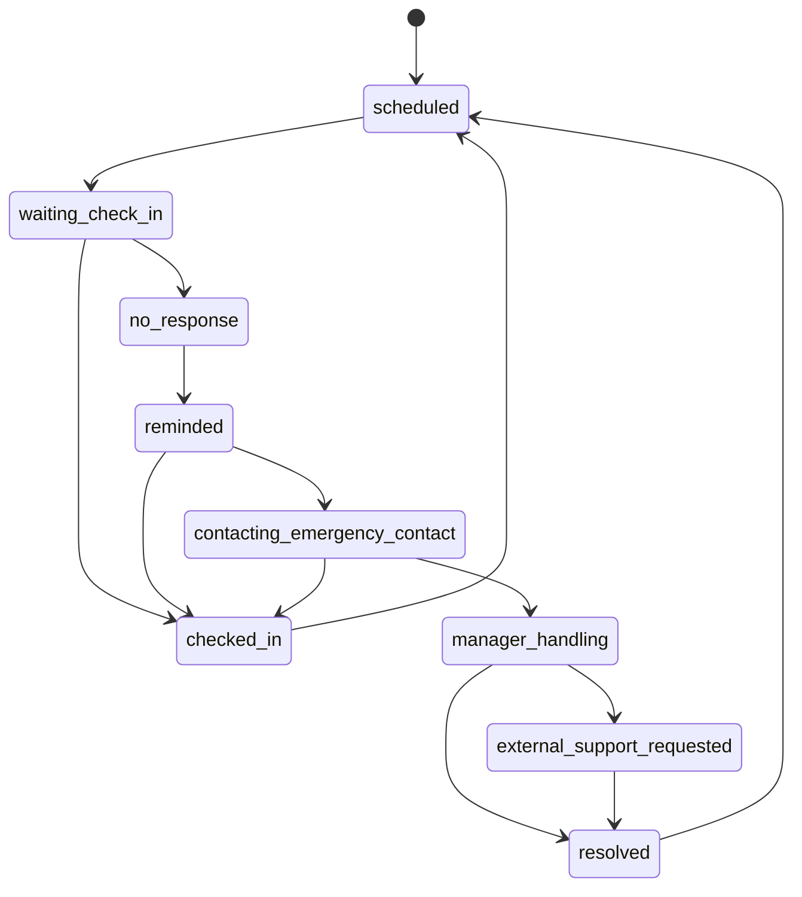

# MVP-09 申込・契約・見守りステータスマシン

RentPassでは、画面ごとに状態名がブレると、通知、権限、監査ログ、オーナー共有のすべてが破綻します。ここでは、MVPで使う状態を **人を評価するスコアではなく、業務プロセスの進行状態** として定義します。

## 設計原則

- ステータスは「この人が危険か」ではなく「何の確認・対策が済んでいるか」を表す。
- 職業名・年齢・国籍をリスクラベルとして使わない。
- 状態遷移は監査ログに残す。
- オーナー向けには詳細状態ではなく、対策済み項目と推奨条件に変換して表示する。
- 不正な戻し・飛ばしを防ぐため、型と遷移関数で制御する。

---

## 1. 申込ステータス

| Status | 表示名 | 意味 | 主な担当 | オーナー表示 |
| --- | --- | --- | --- | --- |
| `draft` | 下書き | 入居希望者または管理会社が作成中 | 入居希望者/管理会社 | 非表示 |
| `submitted` | 申込提出済み | 信用パスが申込に紐づいた | 入居希望者 | 非表示 |
| `document_review` | 書類確認中 | 本人確認・収入・資産・緊急連絡先を確認中 | 管理会社 | 非表示 |
| `additional_info_requested` | 追加提出依頼中 | 不足情報を入居希望者に依頼中 | 管理会社/入居希望者 | 非表示 |
| `condition_design` | 条件設計中 | 前払い・保証・見守り・連絡体制を組み立て中 | 管理会社 | 非表示 |
| `owner_review` | オーナー確認待ち | 入居安心レポートをオーナーへ共有済み | オーナー | 表示 |
| `conditionally_approved` | 条件付き承認 | 条件付きで受け入れ候補になった | オーナー/管理会社 | 表示 |
| `contract_preparation` | 契約準備中 | 契約、初回支払い、保証・保険手続き中 | 管理会社 | 表示 |
| `active_tenancy` | 入居中 | 契約・入居開始後。見守り管理へ移行 | 管理会社 | 表示 |
| `rejected` | 見送り | 今回の条件では受け入れ不可 | オーナー/管理会社 | 表示 |
| `cancelled` | 取消 | 入居希望者または管理会社が申込を取り下げた | 入居希望者/管理会社 | 必要時のみ |

### 申込状態遷移



### 遷移イベント

| Event | From | To | audit log |
| --- | --- | --- | --- |
| `submit_application` | `draft` | `submitted` | required |
| `start_document_review` | `submitted` | `document_review` | required |
| `request_additional_info` | `document_review` | `additional_info_requested` | required |
| `resubmit_documents` | `additional_info_requested` | `document_review` | required |
| `start_condition_design` | `document_review` | `condition_design` | required |
| `share_owner_report` | `condition_design` | `owner_review` | required |
| `owner_approve_with_conditions` | `owner_review` | `conditionally_approved` | required |
| `owner_request_changes` | `owner_review` | `condition_design` | required |
| `owner_reject` | `owner_review` | `rejected` | required |
| `start_contract_preparation` | `conditionally_approved` | `contract_preparation` | required |
| `activate_tenancy` | `contract_preparation` | `active_tenancy` | required |
| `cancel_application` | active non-final statuses | `cancelled` | required |

---

## 2. 見守りステータス

| Status | 表示名 | 意味 | 主な担当 | オーナー表示 |
| --- | --- | --- | --- | --- |
| `scheduled` | 予定済み | 次回チェックイン予定が設定されている | システム | 実施中 |
| `waiting_check_in` | 応答待ち | 本人への安否確認を送信済み | 入居者 | 実施中 |
| `checked_in` | 応答済み | 本人が「元気です」等を押した | 入居者 | 正常 |
| `no_response` | 未応答 | 判定時間を過ぎても応答なし | システム | 要対応あり |
| `reminded` | 再通知済み | 本人へ再通知済み | システム/管理会社 | 要対応あり |
| `contacting_emergency_contact` | 緊急連絡先へ連絡中 | 緊急連絡先への通知・連絡中 | 管理会社 | 要対応あり |
| `manager_handling` | 管理会社対応中 | 管理会社担当者が対応中 | 管理会社 | 要対応あり |
| `external_support_requested` | 外部支援依頼中 | 訪問・支援法人等へ連携中 | 管理会社/支援者 | 要対応あり |
| `resolved` | 解決済み | 安否確認または誤検知として解決 | 管理会社 | 解決済み |

### 見守り状態遷移



### 見守りアラート重要度

| Level | 表示名 | 条件例 | 初期対応 |
| --- | --- | --- | --- |
| `none` | 正常 | 予定どおり応答済み | なし |
| `caution` | 確認待ち | 予定時刻を過ぎたが猶予内 | 本人へ再通知 |
| `warning` | 要確認 | 未応答判定時間を超過 | 緊急連絡先へ通知 |
| `urgent` | 緊急対応 | 長時間未応答、または支援要請あり | 管理会社/外部支援へ連携 |

---

## 3. 契約・支払いステータス

| Status | 表示名 | 意味 |
| --- | --- | --- |
| `not_started` | 未開始 | 契約準備前 |
| `preparing` | 準備中 | 契約書・重要事項・保証・保険を準備中 |
| `waiting_signature` | 署名待ち | 入居者/貸主の署名待ち |
| `waiting_initial_payment` | 初回入金待ち | 初期費用・前払い・保証料等の確認待ち |
| `ready_to_move_in` | 入居準備完了 | 入居開始前の条件が揃った |
| `active` | 契約中 | 入居中 |
| `ended` | 終了 | 契約終了 |
| `cancelled` | 取消 | 契約前に取消 |

---

## 4. 実装方針

### 型定義

- `ApplicationStatus`
- `MonitoringStatus`
- `ContractStatus`
- `StatusTone`
- `StatusMeta`
- `StatusTransitionEvent`

### 関数

- `canTransitionApplicationStatus(from, to)`
- `canTransitionMonitoringStatus(from, to)`
- `getApplicationStatusMeta(status)`
- `getMonitoringStatusMeta(status)`

### audit log に残す項目

```text
actor_id
actor_role
action
entity_type
entity_id
from_status
to_status
reason
created_at
```

## 完了条件

- ステータス一覧が `src/types/index.ts` に反映されている。
- 不正な状態遷移を防ぐ関数がある。
- UI表示用の日本語ラベルと tone がある。
- 申込・見守り・契約の状態変更は audit log 対象であることが明記されている。
